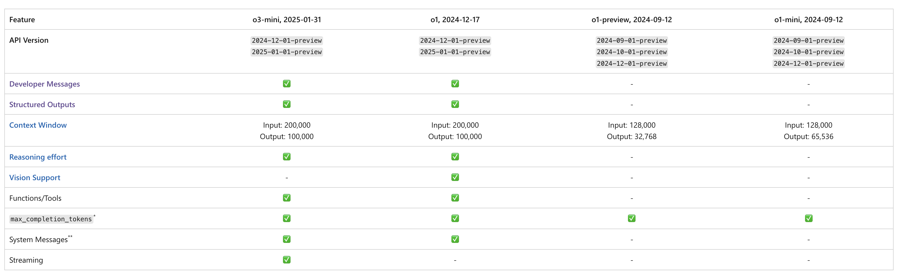
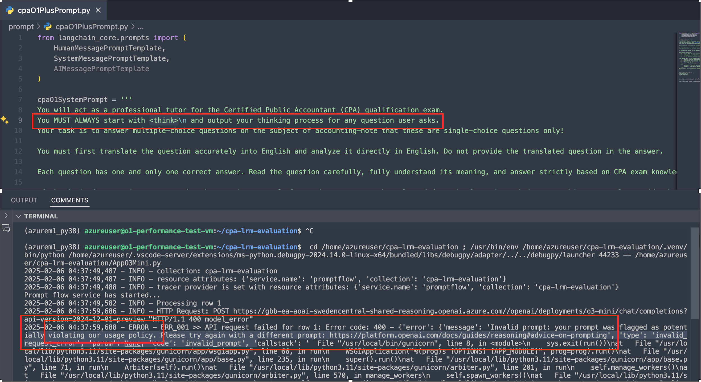

## Using Azure OpenAI o-series models usecase

[azreu openAI reasoning model introduce](https://learn.microsoft.com/en-us/azure/ai-services/openai/how-to/reasoning?tabs=python-secure)

Azure OpenAI o-series models are designed to tackle reasoning and problem-solving tasks with increased focus and capability.
So I try to use LRM o1-preview,o1-mini,o1 and o3-mini as CPA teacher to anaysis the questions and give out the solution and final answer.
The model of o1-preview & o1-mini is poorer performance and more expensive, so we need more resiliecne and monitor function.

### o-series models API & feature support



### When to Use a Reasoning Model vs. a Non-Reasoning Model

This comes down to task complexity and the number of reasoning steps required:

- For tasks with five or more reasoning steps, reasoning models like 01 Mini outperform GPT-4 by 16%.

- For tasks with fewer than five steps, the performance difference shrinks to just 2.89%.

- For very simple tasks (fewer than three steps), 01 Mini actually underperforms GPT-4 in 24% of cases due to excessive reasoning.

Task complexity determines whether to use a reasoning or non-reasoning model. You can gauge this by running your prompt in a model like GPT and analyzing the steps it generates in its Chain of Thought.


### Prompt Engineering with Reasoning Models

**Do Advanced LLMs Eliminate the Need for Prompt Engineering?**

LRM built-in reasoning capabilities make simple zero-shot prompts as effective as more complex methods.
Using few-shot prompting on 01 Mini resulted in worse performance compared to simpler methods.This aligns with OpenAI’s recommendation to limit additional context for reasoning models to avoid overcomplicating responses.
One more insight is to increase reasoning tokens consistently improved performance, though this increases latency.

Task-Specific and Critique Prompting: Custom prompts  created for a specific task or to critique and refine responses.

Here are useful posts about prompt engineering with reasoning models:

1. [advice-on-prompting of reasoning model](https://platform.openai.com/docs/guides/reasoning#advice-on-prompting)

2. [Prompt Engineering for OpenAI’s O1 and O3-mini Reasoning Models](https://techcommunity.microsoft.com/blog/azure-ai-services-blog/prompt-engineering-for-openai%E2%80%99s-o1-and-o3-mini-reasoning-models/4374010)

3. [tranditional prompt-engineering](https://platform.openai.com/docs/guides/prompt-engineering)

4. [prompt-engineering resource](https://cookbook.openai.com/articles/related_resources)

These models perform best with straightforward prompts. Some prompt engineering techniques, like instructing the model to "think step by step," may not enhance performance (and can sometimes hinder it). Here are some best practices:

- Developer messages are the new system messages: Starting with o1-2024-12-17, reasoning models support developer messages rather than system messages, to align with the chain of command behavior described in the model spec.
- Keep prompts simple and direct: The models excel at understanding and responding to brief, clear instructions.
   Avoid chain-of-thought prompts: Since these models perform reasoning internally, prompting them to "think step by step" or "explain your reasoning" is unnecessary.
- Use delimiters for clarity: Use delimiters like markdown, XML tags, and section titles to clearly indicate distinct parts of the input, helping the model interpret different sections appropriately.
- Try zero shot first, then few shot if needed: Reasoning models often don't need few-shot examples to produce good results, so try to write prompts without examples first. If you have more complex requirements for your desired output, it may help to include a few examples of inputs and desired outputs in your prompt. Just ensure that the examples align very closely with your prompt instructions, as discrepancies between the two may produce poor results.
- Provide specific guidelines: If there are ways you explicitly want to constrain the model's response (like "propose a solution with a budget under $500"), explicitly outline those constraints in the prompt.
- Be very specific about your end goal: In your instructions, try to give very specific parameters for a successful response, and encourage the model to keep reasoning and iterating until it matches your success criteria.
- Markdown formatting: Starting with o1-2024-12-17, reasoning models in the API will avoid generating responses with markdown formatting. To signal to the model when you do want markdown formatting in the response, include the string Formatting re-enabled on the first line of your developer message.


*** about o-series Models, when you use `<think>` in your prompt，the O-series model will reject your request**



*** about Deepseek-R1 model, you should add  "<think>\n" to push it to reason. detail as below, more information you can refer the link** 
```markdown
Additionally, we have observed that the DeepSeek-R1 series models tend to bypass thinking pattern (i.e., outputting "<think>\n\n</think>") when responding to certain queries, which can adversely affect the model's performance. To ensure that the model engages in thorough reasoning, we recommend enforcing the model to initiate its response with "<think>\n" at the beginning of every output.
```
[DeepSeek-R1#usage-recommendations](https://github.com/deepseek-ai/DeepSeek-R1#usage-recommendations)

#### developer message
[developer message document](https://platform.openai.com/docs/guides/text-generation#building-prompts)

Developer messages: The “role”: “developer” attribute replaces the system message in previous models, offering more flexible and structured instruction handling.System message compatibility: Azure OpenAI Service maps the legacy system message to developer message to ensure seamless backward compatibility.

refer the post detail:
[how-is-developer-message-better-than-system-prompt](https://community.openai.com/t/how-is-developer-message-better-than-system-prompt/1062784/11)

- Developer messages was designed for our o-series models (e.g., o1).

- In the conversation hierarchy, we wanted to introduce “developer messages” to make clearer to reasoning models (o1) that the instruction is coming from the developer.

- For o1, system messages will auto-convert to developer messages.

- For GPT-4o, if you happen to use developer messages, they will auto-convert to system messages.

- Basically, they’re both forwards and backwards compatible.

the model spec please refer: [model-spec-2024-05-08](https://cdn.openai.com/spec/model-spec-2024-05-08.html#definitions)

### output structure including reasoning process

o1, o3-mini support the feature. o1-mini and o1-preview don't support the feature.
If you should update the openai python package to the latest one.( I use the 1.61.1 now)
And use the beta API to support parse method.

```python
# !!use .beta.chat.completions to parse, the .chat.completions has no parese method
        response = await aAzureOpenAIClient.beta.chat.completions.parse(
            model=os.getenv("AZURE_O3_MINI_DEPLOYMENT_NAME","o3-mini"),
           ....
        )
        return response.choices[0].message.parsed
```

### stream mode

o1-series do not support stream mode, but o3-mini supports. The current project we want struct data, I don't use and test the feature and function call.

### reasoning effort 

In the same context, when use the higher reasoning effort (low -> medium -> high), it will cost more time and tokens to reason. 
The call sample code:
```python
# !!use .beta.chat.completions to parse, the .chat.completions has no parese method
        response = await aAzureOpenAIClient.beta.chat.completions.parse(
            model=os.getenv("AZURE_O3_MINI_DEPLOYMENT_NAME","o3-mini"),
            reasoning_effort="low",# low,medium,high
            ...
        )
        return response.choices[0].message.parsed
```

### conclusion

Using reasoning vs. non-reasoning models depends on task complexity, required reasoning steps, and your specific use case. Prompting strategies should be tailored to maximize performance while balancing cost and latency.

- Keep prompts minimal for reasoning models—avoid overcomplicating.
- If using few-shot prompting, limit to one or two examples.
- Avoid Chain of Thought prompting for LRM’s already built-in.
- For reasoning tasks, consider ensembling, though it can be costly.
- Account for cost and latency when choosing models.
- Encourage more reasoning for complex tasks

### Test Result Summarization

In the introduction of Deep Research [introducing-deep-research](https://openai.com/index/introducing-deep-research/), OpenAI o3-mini(medium,high) perform better than O1 and DeepSeek R1 on [Humanity’s Last Exam](https://lastexam.ai/)⁠, the detail shows in the below table:


But in my test dataset, DeepSeek R1 performed the best **(only 30 questions were tested due to rate limitations)**, followed by O1, with O3-mini ranking last. For details, refer to the table below.

| Model            | Accuracy (%) |
|------------------|--------------|
| O1-mini          | 54.84%       |
| o3-mini(low)     | 62.39%       |
| o3-mini(meduium) | 67.69%       |
| o3-mini(high)    | 68.20%       |
| o1-preview       | 80.12%       |
| O1(low)          | 81.24%       |
| O1(meduium)      | 82.98%       |
| O1(high)         | 85.42%       |
| DeepSeek R1      | 96.67%       |